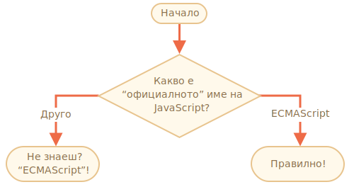

Важност: 2

---

# Името на JavaScript

Като използвате структура от `if..else`, напишете код, което пита: 'Какво е "официалното" име на JavaScript?'

Ако посетителите въведат "ECMAScript", им известете с "Правилно!", иначе: "Не знаеш? ECMAScript!"

[demo src="ifelse_task2"]
