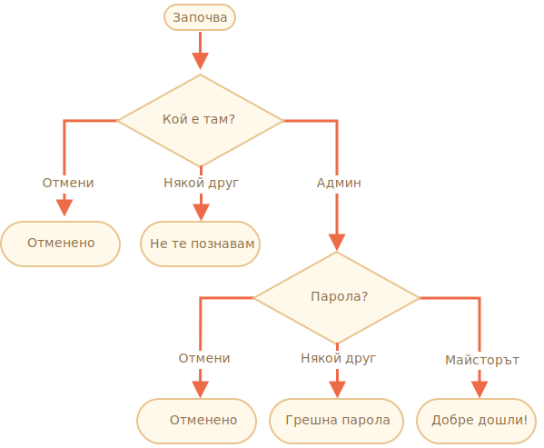

importance: 3

---

# Проверете данните за вход

Напишете кода, който изисква вход с `prompt`.

Ако посетителят влезе като `"Admin"`, тогава попитайте с `prompt` за парола,ако входът е празен ред или е натиснат клавиша `key:Esc` -- покажете "Отменен",ако е друг низ -- тогава покажете "Не те познавам".

Паролата се проверява, както следва:

- Ако се равнява на "TheMaster", тогава покажете "Добре дошли!".
- Ако е друг низ - покажете "Грешна парола".
- За празен низ или анулиран вход покажете "Отменено".

Схема:

Моля, използвайте вложени `if` блокове. Имайте предвид общата четимост на кода.

Подсказка: преминаване на празен вход към `prompt` връща празен низ `''`. Ако се натисне `key:ESC` по време на запитването с `prompt`, то ще връща `null`.

[demo]
