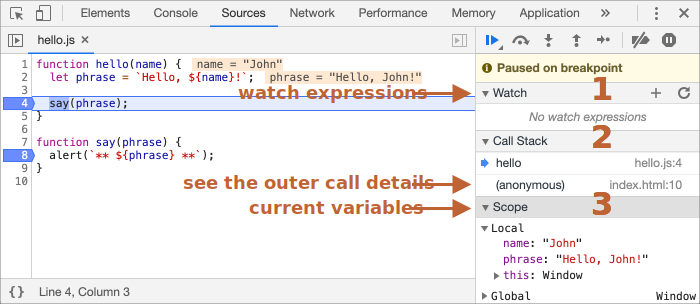

# Дебъгване в Chrome

Преди да започнем да пишем по-сложен код, нека поговорим за дебъгването.

[Debugging](https://en.wikipedia.org/wiki/Debugging) е процес при който се откриват и оправят грешки в кода. Всички съвременни браузъри и повечето други среди поддържат инструменти за дебъгване -- специален UI в developer tools (инструментите за разработчици), който прави дебъгването много по-лесно. Те позволяват да се проследи изпълнението на кода стъпка по стъпка за да видим какво точно се случва.

Ние ще използваме Chrome, защото има достатъчно функции, повечето от одругите браузъри имат подобен процес.

## Панелът "Sources"

Вашата версия на Chrome може да изглежда различно, но основните неща са си същите.

- Отворете [example page](debugging/index.html) в Chrome.
- Активирайте developer tools (инструментите за разработчици) с `key:F12` (Mac: `key:Cmd+Opt+I`).
- Изберете `Sources` панелът.

Ето какво ще видите, ако правите това за първи път:


Бутонът <span class="devtools" style="background-position:-172px -98px"></span> отваря табът с файлове.

Нека кликнем на него и изберем `hello.js` в дървовидния изглед. Ето какво ще се покаже:


Панелът Sources има 3 части:

1. Панелът **File Navigator (файлов навигатор)** показва HTML, JavaScript, CSS и други файлове, включително изображения, които са прикрепени към страницата. Тук може да се показват и разширения на Chrome.
2. Панелът **Code Editor** показва сорс кода.
3. Панелът **JavaScript Debugging** е за дебъгване. Ще го разгледаме скоро.

Сега кликнете отново на същия бутон <span class="devtools" style="background-position:-172px -122px"></span> за да скриете списъка с ресурсите и да освободите повече място за кода.

## Конзола

Ако натиснем `key:Esc`, долу ще се отвори конзолата. В нея може да пишем команди и като натиснем `key:Enter` да ги изпълним.

След като се изпълни инструкцията, резултатът се показва долу.

Например `1+2` връща `3`, а `hello("debugger")` не връща нищо и затова резултатът е `undefined`:


## Breakpoints (Брейкпоинти)

Нека видим какво се случва вътре в кода на [example page](debugging/index.html). В `hello.js`, кликнете на ред `4`. Да, точно на числото `4`  а не на кода.

Поздравления! Поставихте брейкпойнт. Моля, кликнете също и на числото `8`.

Би трябвало да изглежда така (синьото е където трябва да кликнете):


*Брейкпойнтът* е място в кода, където дебъгерът автоматично ще паузира изпълнението на JavaScript.

Докато кодът е паузиран, може да проследим текущите променливи, да изпълняваме команди в конзолата и т.н. С други думи можем да го дебъгваме.

В дясния панел има списък с брейкпойнти. Това е полезно когато имаме много брейкпойнти в различни файлове. Този списък ни позволява:
- Бързо да прескочим до брейкпойнт в кода (като кликнем на него в дясния панел).
- Временно да деактивираме брейкпойнт като го размаркираме.
- Да премахнем брейкпойнт като кликнем на него с десен бутон на мишката и изберем Remove.
- ...И така нататък.

```smart header="Conditional breakpoints (Условни брейкпойнти)"
*Кликване с десен бутон на мишката* върх номера на реда, ни позволява да създадем *conditional (условен)* брейкпойнт. Той се активира само когато зададеното условие е вярно.

Това е полезно когато искаме изпълнението на кода да спре при конкретна стойност или параметри на функция.
```

## Командата Debugger

Може да спрем изпълнението на кода и като използваме командата `debugger` в него ето така:

```js
function hello(name) {
  let phrase = `Здравей, ${name}!`;

*!*
  debugger;  // <-- дебъгерът спира изпълнението на кода тук
*/!*

  say(phrase);
}
```

Това е много удобно, когато сме в code editor (редактор на код) и не искаме да превключваме към браузъра и да гледаме скрипта в инструментите за разработчици, за да поставим брейкпойнт. 


## Паузирай кода и виж какво се случва

В нашия пример, `hello()` се извиква по време на зареждането на страницата, така че най-лесният начин да активираме дебъгера (след като сме сложили брейкпойнти) е да презаредим страницата. За целта натиснете `key:F5` (Windows, Linux) or `key:Cmd+R` (Mac).

Тъй като има поставен брейкпойнт, изпълнението на програмата спира на ред 4:



Моля отворете информационните падащи менюта отдясно (маркирани със стрелки). Те ни позволяват да видим текущото състояние на кода:

1. **`Watch` -- показва текущата стойност за даден израз.**

    Може да натиснете знакът плюс `+` и да въведете израз. Дебъгерът ще покаже неговата стойност във всеки един момент, като в преизчислява автоматично в процеса на изпълнение ма кода. 

2. **`Call Stack` -- показва веригата на вложените извиквания.**

    В текущия момент дебъгерът е вътре в `hello()` заявката, извикана от скрипта `index.html` (тук няма функция, затова я наричаме "анонимна").

    If you click on a stack item (e.g. "anonymous"), the debugger jumps to the corresponding code, and all its variables can be examined as well.
3. **`Scope` -- current variables.**

    `Local` shows local function variables. You can also see their values highlighted right over the source.

    `Global` has global variables (out of any functions).

    There's also `this` keyword there that we didn't study yet, but we'll do that soon.

## Tracing the execution

Now it's time to *trace* the script.

There are buttons for it at the top of the right panel. Let's engage them.
<!-- https://github.com/ChromeDevTools/devtools-frontend/blob/master/front_end/Images/src/largeIcons.svg -->
<span class="devtools" style="background-position:-146px -168px"></span> -- "Resume": continue the execution, hotkey `key:F8`.
: Resumes the execution. If there are no additional breakpoints, then the execution just continues and the debugger loses control.

    Here's what we can see after a click on it:

    

    The execution has resumed, reached another breakpoint inside `say()` and paused there. Take a look at the "Call Stack" at the right. It has increased by one more call. We're inside `say()` now.

<span class="devtools" style="background-position:-200px -190px"></span> -- "Step": run the next command, hotkey `key:F9`.
: Run the next statement. If we click it now, `alert` will be shown.

    Clicking this again and again will step through all script statements one by one.

<span class="devtools" style="background-position:-62px -192px"></span> -- "Step over": run the next command, but *don't go into a function*, hotkey `key:F10`.
: Similar to the previous the "Step" command, but behaves differently if the next statement is a function call. That is: not a built-in, like `alert`, but a function of our own.

    The "Step" command goes into it and pauses the execution at its first line, while "Step over" executes the nested function call invisibly, skipping the function internals.

    The execution is then paused immediately after that function.

    That's good if we're not interested to see what happens inside the function call.

<span class="devtools" style="background-position:-4px -194px"></span> -- "Step into", hotkey `key:F11`.
: That's similar to "Step", but behaves differently in case of asynchronous function calls. If you're only starting to learn JavaScript, then you can ignore the difference, as we don't have asynchronous calls yet.

    For the future, just note that "Step" command ignores async actions, such as `setTimeout` (scheduled function call), that execute later. The "Step into" goes into their code, waiting for them if necessary. See [DevTools manual](https://developers.google.com/web/updates/2018/01/devtools#async) for more details.

<span class="devtools" style="background-position:-32px -194px"></span> -- "Step out": continue the execution till the end of the current function, hotkey `key:Shift+F11`.
: Continue the execution and stop it at the very last line of the current function. That's handy when we accidentally entered a nested call using <span class="devtools" style="background-position:-200px -190px"></span>, but it does not interest us, and we want to continue to its end as soon as possible.

<span class="devtools" style="background-position:-61px -74px"></span> -- enable/disable all breakpoints.
: That button does not move the execution. Just a mass on/off for breakpoints.

<span class="devtools" style="background-position:-90px -146px"></span> -- enable/disable automatic pause in case of an error.
: When enabled, and the developer tools is open, a script error automatically pauses the execution. Then we can analyze variables to see what went wrong. So if our script dies with an error, we can open debugger, enable this option and reload the page to see where it dies and what's the context at that moment.

```smart header="Continue to here"
Right click on a line of code opens the context menu with a great option called "Continue to here".

That's handy when we want to move multiple steps forward to the line, but we're too lazy to set a breakpoint.
```

## Logging

To output something to console from our code, there's `console.log` function.

For instance, this outputs values from `0` to `4` to console:

```js run
// open console to see
for (let i = 0; i < 5; i++) {
  console.log("value,", i);
}
```

Regular users don't see that output, it is in the console. To see it, either open the Console panel of developer tools or press `key:Esc` while in another panel: that opens the console at the bottom.

If we have enough logging in our code, then we can see what's going on from the records, without the debugger.

## Summary

As we can see, there are three main ways to pause a script:
1. A breakpoint.
2. The `debugger` statements.
3. An error (if dev tools are open and the button <span class="devtools" style="background-position:-90px -146px"></span> is "on").

When paused, we can debug - examine variables and trace the code to see where the execution goes wrong.

There are many more options in developer tools than covered here. The full manual is at <https://developers.google.com/web/tools/chrome-devtools>.

The information from this chapter is enough to begin debugging, but later, especially if you do a lot of browser stuff, please go there and look through more advanced capabilities of developer tools.

Oh, and also you can click at various places of dev tools and just see what's showing up. That's probably the fastest route to learn dev tools. Don't forget about the right click and context menus!
