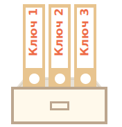
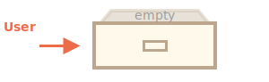
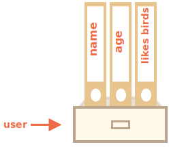

# Обекти

Както знаем от главата <info:types>, има осем типа данни в JavaScript. Седем от тях се наричат "примитивни", защото техните стойности съдържат само едно нещо (може да е низ или число, или каквото и да е).

За разлика на това, обектите се използват за съхранение на ключови колекции от различни данни и по-сложни единици. В JavaScript, обектите проникват в почти всеки аспект на езика. Така че първо трябва да ги разберем преди да се потопим по-дълбоко никъде другаде.

Обект може да бъде създаден с фигурни скоби `{…}` с незадължителен списък на *свойства*. Свойството е двойка от "ключ: стойност", където `ключът` е низ (също се нарича и "име на свойството"), и `стойност`, което може да бъде всичко.

Можем да си представим обект като шкаф с подписани файлове. Всяка част от данните се съхранява в своя файл с ключ. Лесно е да намерите файл по неговото име или да добавите / премахнете  даден файл.



Празния обект ("празния шкаф") може да се създаде с помощта на един от два синтаксиса:

```js
let user = new Object(); // синтаксиса "конструктор на обект"
let user = {};  // синстаксиса "литерал на обект" 
```



Обикновено се използват фигурните скоби `{...}`. Тази деклерация се нарича *литерал на обект*.

## Литерали и свойства

Веднага можем да поставим някои свойства в фигурните скоби `{...}` като двойки от "ключ: стойност":

```js
let user = {     // обект
  name: "John",  // чрез ключа "name" съхраняваме стойността "John"
  age: 30        // чрез ключа "age" съхраняваме стойността 30
};
```

Свойството има ключ (също познат като "име" или "идентификатор") преди двоеточието `":"`, и стойноста след нея.

В `user` обекта, има две свойства:

1. Първото свойство има име `"name"` и стойност `"John"`.
2. Второто свойство има име `"age"` и стойност `30`.

Резултата от `user` обекта можем да си го представим като шкаф с две подписани файлове с етикет "name" и "age".


Можем да добавим, изтрием и да четем файловете от него по всяко време.

Стойностите на свойствата са достъпни чрез нотацията на точките:

```js
// достъпваме стойностите на свойствата от обекта:
alert( user.name ); // John
alert( user.age ); // 30
```

Стойността може да бъде от всякакъв тип. Нека сега добавим и булева стойност:

```js
user.isAdmin = true;
```


За да изтрием свойство можем да използваме `delete` оператора:

```js
delete user.age;
```


Можем да използваме и многословни имена за свойства, но тогава те задължително трябва да са с кавички:

```js
let user = {
  name: "John",
  age: 30,
  "likes birds": true  // многословните имена на свойствата трябва да са с кавички
};
```




Последното свойство в списъка може да завърши със запетая:
```js
let user = {
  name: "John",
  age: 30*!*,*/!*
}
```
Това се нарича "влачеща" или "висяща" запетая. Улеснява добавянето / изтриването / местенето около свойствата, защото всички линии стават еднакви.

````smart header="Константа от обект може да бъде променен"
Моля обърнете внимание: обект, деклариран като `const` *може* да бъде модифициран.

Например:

```js run
const user = {
  name: "John"
};

*!*
user.name = "Pete"; // (*)
*/!*

alert(user.name); // Pete
```

Може да изглежда, че линията `(*)` би причинила грешка, но не. Деклараторът `const` фиксира стойността на `user`, но не и съдържанието му.

Деклараторът `const` ще даде грешка само ако се опитаме да зададем `user=...` като цяло.

Има и друг начин да направите свойствата на обекта константи, но ще ги разгледаме по-нататък в главата <info:property-descriptors>.
````

## Квадратни скоби

За многословните свойства достъпът с точки не работи:

```js run
//това би дало синтактична грешка
user.likes birds = true
```

JavaScript не разбира това. Смята, че се обръщаме към `user.likes`, и след това дава синтактична грешка, когато се натъкне неочаквано на `birds`.

Точката изисква ключът да е валиден идентификатор на променлива. Това предполага: не съдържа интервали, не започва с цифра и не включва специални знаци (`$` и `_` са позволени).

Има алтернатива "нотация на квадратни скоби", който работи с всеки низ:

```js run
let user = {};

// задава
user["likes birds"] = true;

// достъпва
alert(user["likes birds"]); // true

// изтрива
delete user["likes birds"];
```

Сега всичко е наред. Моля, обърнете внимание, че низът в скобите е поставен правилно (позволено са `'` и `` ` ``).

Квадратните скоби също предоставят начин за получаване на името на свойството в резултат на всеки израз -- за разлика от буквалния низ -- като от променлива, както следва:

```js
let key = "likes birds";

// същото като user["likes birds"] = true;
user[key] = true;
```

Тука, променливата `key` може да се изчисли по време на изпълнение или да зависи от потребителския вход.И тогава го използваме за достъп до свойството. Това ни дава голяма гъвкавост.

Например:

```js run
let user = {
  name: "John",
  age: 30
};

let key = prompt("Какво искате да знаете относно потребителя?", "name");

// достъп чрез променлива
alert( user[key] ); // John (ако потвърдим "name")
```

Нотацията чрез точки не може да се използва по подобен начин:

```js run
let user = {
  name: "John",
  age: 30
};

let key = "name";
alert( user.key ) // undefined
```

### Изчислени свойства

Можем да използваме квадратни скоби в литерали на обекти, при създаване на обекти. Това се нарича *изчислени свойства*.

Например:

```js run
let fruit = prompt("Кой плод да купя?", "apple");

let bag = {
*!*
  [fruit]: 5, // името на свойството е взето от променливата fruit
*/!*
};

alert( bag.apple ); // 5 ако fruit="apple"
```

Значението на изчисленото свойство е просто: `[fruit]` означава, че името на свойството трябва да бъде взето от `fruit`.

Така, ако посетителят добавя `"apple"`, `bag` ще стане `{apple: 5}`.

По същество това работи също като:
```js run
let fruit = prompt("Кой плод да купя?", "apple");
let bag = {};

// взима името на свойството от променливата fruit
bag[fruit] = 5;
```

...Така изглежда по-хубаво.

Можем да използваме по-сложни изрази вътре в квадратните скоби:

```js
let fruit = 'apple';
let bag = {
  [fruit + 'Computers']: 5 // bag.appleComputers = 5
};
```

Квадратните скоби са много по-мощни от точковата нотация. Те позволяват всякакви имена на свойства и променливи. Но също така са по-тромави за писане.

Така през повечето време, когато имената на свойствата са известни и прости, се използва точката. И ако имаме нужда от нещо по-сложно, тогава преминаваме към квадратни скоби.

## Кратък начин за задаване на стойност на свойство

В реалния код често използваме съществуващите променливи като стойности за имена на свойства.

Например:

```js run
function makeUser(name, age) {
  return {
    name: name,
    age: age,
    // ...other properties
  };
}

let user = makeUser("John", 30);
alert(user.name); // John
```

В горния пример, свойствата имат същите имена като на променливите. Това е обичаен случай на създаване на свойства от променливи, но има *специален кратък начин*, за да го направим по къс.

Вместо `name:name` можем просто да пишем `name`, като тук:

```js
function makeUser(name, age) {
*!*
  return {
    name, // същото на name: name
    age,  // същото на age: age
    // ...
  };
*/!*
}
```

Можем да използваме както нормални свойства, така и краткия вариант в един и същ обект:

```js
let user = {
  name,  // същото като name:name
  age: 30
};
```


## Ограничения в имената на свойствата

Както вече знаем, променлива не може да има име, равна на една от запазените за език думи като "for", "let", "return" и други.

Но за свойство на обект няма такова ограничение:

```js run
// тези свойства са наред
let obj = {
  for: 1,
  let: 2,
  return: 3
};

alert( obj.for + obj.let + obj.return );  // 6
```

Накратко, няма ограничения за имената на свойствата. Те могат да бъдат всякакви низове или символи (специален тип за идентификатори, които ще бъдат изучени по-късно).

Другите типове се преобразуват автоматично в низове.

Например, цифрата `0` става низ `"0"` когато се използва като ключ на свойството:

```js run
let obj = {
  0: "test" // същото на "0": "test"
};

// и двата сигнала имат достъп до едно и също свойство (цифрата 0 се преобразува в низ "0")
alert( obj["0"] ); // test
alert( obj[0] ); // test (същото свойство)
```

Има малка подробност със специалното име на свойство `__proto__`. Не можем да го зададем на стойност, която не е обект:

```js run
let obj = {};
obj.__proto__ = 5; // присвояваме цифра
alert(obj.__proto__); // [object Object] -стойността е обект, не проработи по предназначение
```

Както виждаме от кода, задаването към примитивното `5` се игнорира.

Ще покрием специалния характер на `__proto__` в [следващите глави](info:prototype-inheritance), и да предложим [начини за поправяне](info:prototype-methods) на таково поведение.

## Тест за съществуването на свойство, операторът "in"

Забележителна функция на обектите в JavaScript, в сравнение с много други езици, iе, че е възможен достъп до всяко свойство. Няма да има грешка, ако свойството не съществува!

Четенето на несъществуващо свойство просто връща `undefined`. Така можем лесно да тестваме дали свойството съществува:

```js run
let user = {};

alert( user.noSuchProperty === undefined ); // true означава "че няма подомно свойство"
```

Има и специален оператор `"in"` за тази цел.

Синтаксисът е следния:
```js
"key" in object
```

Например:

```js run
let user = { name: "John", age: 30 };

alert( "age" in user ); // true, user.age съществува
alert( "blabla" in user ); // false, user.blabla НЕ съществува
```

Моля, обърнете внимание, че от лявата страна на `in` трябва да има *име на свойство*. Това обикновено е низ с кавички.

Ако пропуснем кавички, това означава че е променлива, тя трябва да съдържа действителното име, което трябва да бъде тествано. Например:

```js run
let user = { age: 30 };

let key = "age";
alert( *!*key*/!* in user ); // true, свойството "age" съществува
```

Защо `in` операторът съществува? Не е ли достатъчно да се сравнява с `undefined`?

Е, през повечето време сравнението с `undefined` работи достатъчно добре. Но има специален случай, когато не успява, а пък `"in"` се справя отлично.

Това е, когато свойството на обекта съществува, но съхранява `undefined`:

```js run
let obj = {
  test: undefined
};

alert( obj.test ); // то е undefined, така че - няма такова свойство?

alert( "test" in obj ); // true, свойството съществува!
```

В кода по-горе, свойството `obj.test` технически съществува. Така операторът `in` работи правилно.

Ситуации като тази се случват много рядко, защото `undefined` не трябва да бъде изрично зададена.Използваме най-вече `null` за "непознати" или "празни" стойности. Така че `in` операторът е екзотичен гост в кода.


## Цикълът "for..in"

За да итерираме през всички ключове на обекта, съществува специална форма на цикъл: `for..in`. Това е съвсем различно нещо от обикновения `for(;;)` конструкция, която я научихме преди.

Синтаксисът:

```js
for (key in object) {
  // изпълнява тялото за всеки ключ сред свойствата на обекта
}
```

Например, нека изведем всички свойства на `user`:

```js run
let user = {
  name: "John",
  age: 30,
  isAdmin: true
};

for (let key in user) {
  // ключовете
  alert( key );  // name, age, isAdmin
  // стойностите за ключовете
  alert( user[key] ); // John, 30, true
}
```

Обърнете внимание, че всички "for" конструкции ни позволят да добавим цикличната променлива вътре в цикъла, като `let key` тук.

Освен това тук бихме могли да използваме друго име вместо `key`. например, `"for (let prop in obj)"` е широко използван.

### Подредени като обект

Подредени ли са обекти? С други думи, ако се изциклим върху обект, получаваме ли всички свойства в същия ред, в който бяха добавени? Можем ли да разчитаме на това?

Краткият отговор е: "подредени по специален начин": целочислените свойства са сортирани, други се появяват в реда си на създаване. Подробностите следват.

Като пример, нека разгледаме обект с телефонните кодове:

```js run
let codes = {
  "49": "Germany",
  "41": "Switzerland",
  "44": "Great Britain",
  // ..,
  "1": "USA"
};

*!*
for (let code in codes) {
  alert(code); // 1, 41, 44, 49
}
*/!*
```

Обектът може да се използва, за да предложи на потребителя списък с опции. IАко правим сайт главно за немска публика, тогава вероятно искаме `49` да е първият.

Но ако пуснем кода, виждаме съвсем различна картина:

- САЩ (1) отива на първо място
- след това Швейцария (41) и т.н. .

Телефонните кодове вървят във възходящ сортиран ред, защото те са цели числа. Така че виждаме `1, 41, 44, 49`.

````smart header="Целочислени свойства? Какво са те?"
Терминът "Целичислено свойство" означава низ, който може да бъде преобразуван от-и-към целочислена стойност без промяна.

Така, "49" е целочислено име на свойство, защото когато се трансформира в цяло число и обратно, и все още е същото. Но "+49" и "1.2" не са:

```js run
// Math.trunc е вградена функция, която премахва десетичната част
alert( String(Math.trunc(Number("49"))) ); // "49", същото, цяло число
alert( String(Math.trunc(Number("+49"))) ); // "49", не е същото "+49" ⇒ не е цяло число
alert( String(Math.trunc(Number("1.2"))) ); // "1", не е същото "1.2" ⇒ не е цяло число
```
````

...От друга страна, ако ключовете не са цели числа, те са добавени в реда на създаване, например:

```js run
let user = {
  name: "John",
  surname: "Smith"
};
user.age = 25; // добавя още една

*!*
// нецелочислените свойства са добавени в реда на създаване
*/!*
for (let prop in user) {
  alert( prop ); // name, surname, age
}
```

И така, за да отстраним проблема с телефонните кодове, можем "да измамим" като прави кодовете нецелочислени.Добавяне на плюс `"+"` преди всеки код е достатъчен.

Като тук:

```js run
let codes = {
  "+49": "Германия",
  "+41": "Швейцария",
  "+44": "Великобритания",
  // ..,
  "+1": "САЩ"
};

for (let code in codes) {
  alert( +code ); // 49, 41, 44, 1
}
```

Сега работи по предназначение.

## Обобщение

Обектите са асоциативни масиви с няколко специални характеристики.

Те съхраняват свойства (двойки от ключ-стойност), където:
- Свойствените ключове трябва да са низове или символи (обикновено са низове).
- Стойностите могат да бъдат от всякакъв тип.

За достъпим свойството можем да използваме:
- Точката нотация: `obj.property`.
- Нотация на квадратни скоби: `obj["property"]`. Квадратните скоби ни позволяват да вземаме ключ от променливата, например `obj[varWithKey]`.

Допълнителни оператори:
- За да изтриете свойство: `delete obj.prop`.
- За да проверите дали свойството с дадения ключ съществува: `"key" in obj`.
- За да итерирате над обекта: цикъл от `for (let key in obj)`.

Това, което сме проучили в тази глава, се нарича "обикновен обект", или просто `Обект`.

Има много други видове обекти в JavaScript:

- `Array` за съхраняване на подредени колекции от данни,
- `Date` за съхраняване на информация за датата и часа,
- `Error` за съхраняване на информация относно грешка.
- ...И много други.

Те имат своите особености, които ще ги изучим по-късно. Понякога хората казват нещо като "Тип масив" или "Тип данни", но формално те не са свои собствени типове, а принадлежат към "обект" от един и същ тип данни. И се разширяват по различни начини.

Обектите в JavaScript са много мощни. Тук току-що надраскахме повърхността на тема, която е наистина огромна. Ще работим в тясно сътрудничество с обектите и ще научим повече за тях в другите части на това ръководство.
