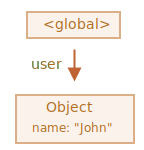

# Garbage collection - Събирач на отпадъци

Управлението на паметта в JavaScript се извършва автоматично и невидимо за нас. Ние създаваме примитиви, обекти, функции ... Всичко, което отнема памет.

Какво се случва, когато нещо вече не е необходимо? Как двигателят на JavaScript го открива и почиства?

## Достъпност

Основната концепция за управление на паметта в JavaScript е *достъпността*.

Просто казано, „достижими“ стойности са тези, които са достъпни или използваеми по някакъв начин. Гарантирано е, че се съхраняват в паметта.

1. Има основен набор от присъщи стойности, които по очевидни причини не могат да бъдат изтрити.

    Например:

    - Локалните променливи и параметри на текущата функция.
    - Променливи и параметри за други функции в текущата верига на вложените повиквания.
    - Глобалните променливи.
    - (има и други, вътрешни)

    Тези стойности се наричат *roots* (корени).

2. Всяка друга стойност се счита за достижима, ако е достижима от корен чрез референция или от верига от референции.

<<<<<<< HEAD
    Например, ако имаме обект в локална променлива, и този обект има свойство рефериращо друг обект, то този обект се смята достижим. И тези, които то реферира също за достъпни. Ето подробни примери.
=======
    For instance, if there's an object in a global variable, and that object has a property referencing another object, that object is considered reachable. And those that it references are also reachable. Detailed examples to follow.
>>>>>>> cdf382de4cf3ed39ca70cb7df60c4c4886f2d22e

Има основен фонов процес в JavaScript двигателя, който се нарича [garbage collector](https://en.wikipedia.org/wiki/Garbage_collection_(computer_science)) (т.н. Събирач на отпадъци). Той следи всички обекти и премахва тези, които са станали недостъпни.

## Един прост пример

Ето най-простият пример:

```js
// user реферира обект
let user = {
  name: "John"
};
```



Тук стрелката изобразява референцията на обект. Глобалната променлива `"user"` реферира обекта `{name: "John"}` (ще го наречем Джон за по-кратко). Свойството `"name"` на Джон съдържа примитивна променлива, затова е нарисуван вътре в обекта.

Ако стойността на `user` се презапише, референцията се губи:

```js
user = null;
```


Сега Джон става недостъпен. Няма начин да получите достъп до него, няма референции към него. Събирачът на отпадъците ще изхвърли нежелана информация и ще освободи паметта.

## Две референции

Сега нека да си представим това, че копираме референцията от `user` на `admin`:

```js
// user реферира обект
let user = {
  name: "John"
};

*!*
let admin = user;
*/!*
```


Сега ако правим същото:
```js
user = null;
```

...Тогава обектът все още е достъпен чрез глобалната променлива `admin`, така че то е в паметта. Ако презапишем също и `admin` променливата, тогава то може да бъде премахнат.

## Свързани обекти

Сега по-сложен пример. Семейството:

```js
function marry(man, woman) {
  woman.husband = man;
  man.wife = woman;

  return {
    father: man,
    mother: woman
  }
}

let family = marry({
  name: "John"
}, {
  name: "Ann"
});
```

Функцията `marry` "свързва" двата обекта като им дава референция и на двете, и връща нов обект, който съдържа тези обекти.

Получената структура на паметта:


Към момента всички обекти са достъпни.

Сега нека премахнем две референции:

```js
delete family.father;
delete family.mother.husband;
```


Не е достатъчно да изтриете само една от тези две референции, защото всички обекти все още ще бъдат достъпни.

Но ако изтрием и двете, тогава можем да видим, че Джон вече няма входяща референция:


Изходящите референции нямат значение. Само входящите могат да направят обект достъпен. И така, Джон сега е недостъпен и ще бъде изваден от паметта с всичките му данни, които също станаха недостъпни.

След събирачът на отпадъци:


## Недостъпен остров

Възможно е целият остров от взаимосвързани обекти да станат недостъпни и да бъдат премахнати от паметта.

Изходният обект е същият като по-горе. Тогава:

```js
family = null;
```

Картината в паметта става:


Този пример показва колко важна е концепцията за достъпност.

Очевидно е, че Джон и Ан все още са свързани, и двете имат входящи референции. Но това не е достатъчно.

Бившият `"family"` обект е прекъсва връзката от корена, вече няма референция към него, така че целият остров става недостъпен и ще бъде премахнат.

## Вътрешни алгоритми

Основният алгоритъм на събирача на отпадъците се нарича "маркиране и почистване".

Следните стъпки на "събирача на отпадъците" се извършват редовно:

- Взима корените и ги "маркира" (запаметява ги).
- Тогава то посещава и "маркира" всички референции от тях.
- Тогава то посещава маркираните обекти и маркира *техните* референции. Всички посетени обекти са запаметени, така че да не се посещава един и същ обект повече от един път.
- ... И така нататък, докато не бъдат посетени всички достижими (от корените) референции.
- Всички обекти с изключение на маркираните се премахват.

Например, нека структурата на обекта да изглежда така:


Ясно можем да видим "недостъпен остров" от дясната страна. Сега да видим как "маркирането и почистването" на събирача на отпадъците се справя с него.

Първата стъпка бележи корените:


Тогава техните референции са маркирани:


...И техните референции, докогато е възможно:


Сега обектите, които не могат да бъдат посетени в процеса, се считат за недостъпни и ще бъдат премахнати:


Можем също да си представим процеса като разливане на огромна кофа боя от корените, която преминава през всички референции и маркира всички достижими обекти. След това немаркираните се премахват.

Това е концепцията за това как работи събирачът на отпадъците. JavaScript двигателите прилагат много оптимизации, за да стартират по-бързо и да не повлияят на изпълнението.

Някои от оптимизациите са:

- **Generational collection** (Колекция от поколения) -- обектите се разделят на две групи: "нови" и "стари". Появяват се много предмети, вършат си работата и умират бързо, те могат да бъдат почистени агресивно. Тези, които оцеляват достатъчно дълго, стават "стари" и се изследват по-рядко.
- **Incremental collection** (Постепенно събиране) -- ако има много обекти и се опитаме да ходим и маркираме целия набор от обекти наведнъж, може да отнеме известно време и да въведем видими закъснения в изпълнението. Така двигателят се опитва да раздели събирача на отпадъците на парчета. След това парчетата се изпълняват едно по едно, отделно. Това изисква някои допълнителни счетоводни услуги между тях, за да се проследят промените, но имаме много малки закъснения вместо големи.
- **Idle-time collection** (Колекция на празен ход) -- Събирачът на отпадъците се опитва да работи само докато процесорът бездейства, за да намали възможния ефект върху изпълнението.

Съществуват други оптимизации и аромати на алгоритмите на събирача на отпадъците. Колкото и да бих искал да ги опиша тук, трябва да отложа, защото различните двигатели прилагат различни оптимизации и техники. И, което е още по-важно, нещата се променят с развитието на двигателите, така че изучаването по-дълбоко „предварително“, без реална нужда, вероятно не си струва. Освен ако, разбира се, не става въпрос за чист интерес, тогава по-долу ще има някои връзки за вас.

## Обобщение

Основните неща, които трябва да знаете:

- *Garbage collector* (Събирачът на отпадъците) се изпълнява автоматично. Не можем да го насилваме или предотвратяваме.
- Обектите се запазват в паметта, докато са достъпни.
- Референцията не е същото като достъпността (от корен): пакет от взаимосвързани обекти могат да станат недостъпни като цяло.

Съвременните двигатели прилагат усъвършенствани алгоритми за събирача на отпадъците.

Общата книга "The Garbage Collection Handbook: The Art of Automatic Memory Management" (R. Jones et al) обхваща някои от тях.

Ако сте запознати с програмирането на ниско ниво, по-подробната информация за V8 събирача на отпадъците е в статията *[A tour of V8: Garbage Collection](http://jayconrod.com/posts/55/a-tour-of-v8-garbage-collection)*.

[Блогът V8](https://v8.dev/) също публикува статии за промените в управлението на паметта от време на време. Естествено, за да научите събирача на отпадъците, по-добре се подгответе, като се запознаете с V8 вътрешността като цяло и прочетете блога на [Вячеслав Егоров](http://mrale.ph) работил като един от V8 инженерите. Казвам: "V8", защото е най-добре покрито със статии в интернет. За други двигатели много подходи са сходни, но събирачът на отпадъците се различава в много аспекти.

Задълбочените познания на двигателите са добри, когато се нуждаете от оптимизации на ниско ниво. Би било разумно да планирате това като следваща стъпка, след като сте запознати с езика.
