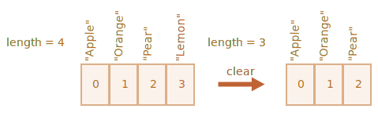

# Arrays / Масиви

Обектите ви позволяват да пазите колекции от ключове и техните стойности. Това е добре. 

Но много често на нас ни е нужна *подредена колекция*, където имаме 1-ви 2-ри, 3-ти елемент и така нататък. Например трябва да пазим списък с неща: потребители, стоки, HTML елементи и т.н.

В този случай не е удобно да използваме обект, защото той няма методи, които ни позволяват да манипулираме поредността на елементите. Не можем да вмъкнем ново property “между” съшествуващите. Обектите не са предвидени за такава употреба.

Съществува специална структура от данни, наречена `Array`/ Масив, в която се съхраняват подредени колекции.

## Деклариране

Има два синтаксиса за създаване на празен масив:

```js
let arr = new Array();
let arr = [];
```

Почти винаги се използва вторият синтаксис. Можем да подадем начални стойности в скобите:

```js
let fruits = ["Apple", "Orange", "Plum"];
```

Елементите на масива са подредени, започвайки от 0.

Можем да достъпим елемент чрез неговия номер в квадратни скоби:

```js run
let fruits = ["Apple", "Orange", "Plum"];

alert( fruits[0] ); // Apple
alert( fruits[1] ); // Orange
alert( fruits[2] ); // Plum
```

Можем да заменим елемент:

```js
fruits[2] = 'Pear'; // now ["Apple", "Orange", "Pear"]
```

...Или да добавим нов елемент в масива:

```js
fruits[3] = 'Lemon'; // now ["Apple", "Orange", "Pear", "Lemon"]
```

Броят на елементите в масива е неговата `length`/`дължина`:

```js run
let fruits = ["Apple", "Orange", "Plum"];

alert( fruits.length ); // 3
```

Може да използваме `alert` да покаже целия масив.

```js run
let fruits = ["Apple", "Orange", "Plum"];

alert( fruits ); // Apple,Orange,Plum
```

Маисвът може да съхранява елементи от всякакъв тип.

Например:

```js run no-beautify
// mix of values
let arr = [ 'Apple', { name: 'John' }, true, function() { alert('hello'); } ];

// вземи обекта на индекс 1 и покажи неговото име
alert( arr[1].name ); // John

// вземи функцията на индекс 3 и я изпълни
arr[3](); // hello
```


````smart header="Trailing comma / Последваща запетая"
Масивът, също както и обекта, може да завършва със запетая:
```js
let fruits = [
  "Apple",
  "Orange",
  "Plum"*!*,*/!*
];
```

Този стил "trailing comma" позволява лесно да се вмъват/премахват елементи, защото всички линии стават еднакви.
````

## Get last elements with "at"

[recent browser="new"]

Let's say we want the last element of the array.

Some programming languages allow the use of negative indexes for the same purpose, like `fruits[-1]`.

Although, in JavaScript it won't work. The result will be `undefined`, because the index in square brackets is treated literally.

We can explicitly calculate the last element index and then access it: `fruits[fruits.length - 1]`.

```js run
let fruits = ["Apple", "Orange", "Plum"];

alert( fruits[fruits.length-1] ); // Plum
```

A bit cumbersome, isn't it? We need to write the variable name twice.

Luckily, there's a shorter syntax: `fruits.at(-1)`:

```js run
let fruits = ["Apple", "Orange", "Plum"];

// same as fruits[fruits.length-1]
alert( fruits.at(-1) ); // Plum
```

In other words, `arr.at(i)`:
- is exactly the same as `arr[i]`, if `i >= 0`.
- for negative values of `i`, it steps back from the end of the array.

## Методи pop/push, shift/unshift

Това [queue](https://en.wikipedia.org/wiki/Queue_(abstract_data_type)) е един от най-честите случаи, в които се използват масиви. В компютърните науки това означава подредена колекция от елементи, която поддържа две операции:

- `push` добавя елемент в края на масива.
- `shift` взема първия елемент в началото на масива и премества всички останали напред, така че вторият елемент става първи, третият става втори  и т.н.


Маисвите поддържат и двете операции.

В практиката ние ги използваме много често. Например опашка със съобщения, които трябва да бъдат показани на екрана.

Има още един случай в който се използват масиви -- структура от данни, наречена [stack](https://en.wikipedia.org/wiki/Stack_(abstract_data_type)).

Той поддържа две опврации:

- `push` добавя елемент в края на масива.
- `pop` премахва елемент от края на масива.

Така че новите елементи са добавени или извадени от "края" на масива.

Stack обикновено се илюстрира с тесте от карти: новите карти се добавят или вадят от горе:


При stacks/ стековете, последният добавен елемент се обработва първи, това е така нареченият LIFO (Last-In-First-Out) принцип. При queues/опашките, имаме FIFO (First-In-First-Out).

<<<<<<< HEAD
Масивите в JavaScript могат да работят и като опашки и като стекове. Те позволяват да се добавят/премахват елементи едновременно от началото и края.

В компютърните науки структурата, която позволява това, се нарича [deque](https://en.wikipedia.org/wiki/Double-ended_queue).
=======
Arrays in JavaScript can work both as a queue and as a stack. They allow you to add/remove elements, both to/from the beginning or the end.

In computer science, the data structure that allows this, is called [deque](https://en.wikipedia.org/wiki/Double-ended_queue).
>>>>>>> 5dff42ba283bce883428c383c080fa9392b71df8

**Методи, които работят с края на масива:**

`pop`
: Премахва последния елемент от масива и го връща като стойност:

    ```js run
    let fruits = ["Apple", "Orange", "Pear"];

    alert( fruits.pop() ); // махни "Pear" и го изпиши в alert

    alert( fruits ); // Apple, Orange
    ```

    Both `fruits.pop()` and `fruits.at(-1)` return the last element of the array, but `fruits.pop()` also modifies the array by removing it.

`push`
: Добавя елемент в края на масива:

    ```js run
    let fruits = ["Apple", "Orange"];

    fruits.push("Pear");

    alert( fruits ); // Apple, Orange, Pear
    ```

    Извикването `fruits.push(...)` е равносилно на `fruits[fruits.length] = ...`.

**Методи, които работят с началото на масива:**

`shift`
: Премахва първия елемент на масива и го връща като стойност:

    ```js run
    let fruits = ["Apple", "Orange", "Pear"];

    alert( fruits.shift() ); // премахни Apple и го изпиши в alert

    alert( fruits ); // Orange, Pear
    ```

`unshift`
: Добавя елемент в началото на масива:

    ```js run
    let fruits = ["Orange", "Pear"];

    fruits.unshift('Apple');

    alert( fruits ); // Apple, Orange, Pear
    ```

Методите `push` и `unshift` могат да добавят множество елементи наведнъж:

```js run
let fruits = ["Apple"];

fruits.push("Orange", "Peach");
fruits.unshift("Pineapple", "Lemon");

// ["Pineapple", "Lemon", "Apple", "Orange", "Peach"]
alert( fruits );
```

## Internals

Масивът е специален вид обект. Квадратните скоби, които се използват, за да се достъпи свойство `arr[0]` всъщност идват от синтаксиса на обекта. По същество това е същото като `obj[key]`, където `arr` е обекта, докато числата се използват като ключове.

Масивите надграждат обектите, като предоставят специални методи за работа с подредени колекции от данни и също с пропъртито `length`. Но в основата си те са обекти.

Запомнете, има само 8 прости типове данни в JavaScript (вижте [Data types](info:types) за повече информация). Масивът е обект и се държи като такъв.

Например, той се копира по референция:

```js run
let fruits = ["Banana"]

let arr = fruits; // копиране по референция (две променливи сочат към един и същи масив)

alert( arr === fruits ); // вярно

arr.push("Pear"); // променяме масива по референция

alert( fruits ); // Banana, Pear - сега има 2 записа
```

...Това, което прави масивите наистина специални, е тяхното вътрешно представяне. Енджинът се опитва да съхранява елементите на масива в съседна област на паметта, един след друг, точно както е показано на илюстрацията в тази глава. Има и други оптимизации, които позволяват масивите да работят много бързо.

Но всичко това ще се счупи ако спрем да работим с масивите като "подредени колекции" и започнем да ги използваме като обикновени обекти.

Например технически погледнато можем да направим това:

```js
let fruits = []; // създаваме масив

fruits[99999] = 5; // записваме пропърти с индекс, който е много по-голям от дължината на масива

fruits.age = 25; // създаваме пропърти със случайно име, нямащо нищо общо с елементите, които се съхраняват в масива
```

Това е възможно защото масивите са обекти в основата си. Можем да им добавяме всякакви пропъртита.

Но енджинът ще види, че ние работим с масива като с обиновен обект. Оптимизации, специфични за масивите, не са подходящи в такива случаи и ще бъдат изключени, техните предимства ще изчезнат. 

Начини да злоупотребим с използването на масивите:

- добавяне на пропърти, което не е число `arr.test = 5`.
- правене на дупки в масива: добавяме `arr[0]` и после `arr[1000]` (и нищо между тях).
- запълване на масива в обратен ред: `arr[1000]`, `arr[999]` и т.н.

Мислете за масивите като за специални структури, които работят с *подредени данни*. Те разполагат със специални методи за това. Маисвите са специално конфигурирани в JavaScript енджина да работят със съседни подредени данни. Моля използвайте ги по този начин. И ако се нуждаете от произволни ключове, има голям шанс всъщност да се нуждаете от обикновен обект `{}`.

## Performance

Методите `push/pop` се изпълняват бързо, докато `shift/unshift` са бавни.


Защо е по-бързо да се работи с края на масива, отколкото с началото му? Нека видим какво се случва по време на изпълнение на кода:

```js
fruits.shift(); // взима един елемент от началото
```

<<<<<<< HEAD
Не е достатъчно да вземе и да премахне елемента с номер/ позиция `0`. Другите елементи също трябва да променят позицията си с едно напред.
=======
It's not enough to take and remove the element with the index `0`. Other elements need to be renumbered as well.
>>>>>>> 5dff42ba283bce883428c383c080fa9392b71df8

Операцията `shift` трябва да направи 3 неща:

1. Премахва елемента с индекс `0`.
2. Премества всички елементи наляво и сменя индексите им от `1` на `0`, от `2` на `1` и т.н.
3. Променя `length` пропъртито.


**Колкото повече елеменити има в масива, толкова повече време и памет ще отнеме.**

Същото нещо се случва с `unshift`: за да добавим елемент в началото на масива, ние първо трябва да преместим съществуващите елементи надясно и да увеличим техните индекси.

А какво се случва с `push/pop`? При тях не трябва да се мести нищо. За да извади елемент от края на масива методът `pop` трие този индекс и намалява стойността на `length`.

Действията за метода `pop`:

```js
fruits.pop(); // взима 1 елемент от края
```



**Методът `pop` не трябва да мести нищо, защото другите елементи пазят своите индекси. Затова е толкова бърз.**

Същото важи и за метода `push`.

## Loops/ Цикли

Един от най-старите начини да обходим елементите на масива е с `for` цикъл през техните индекси:

```js run
let arr = ["Apple", "Orange", "Pear"];

*!*
for (let i = 0; i < arr.length; i++) {
*/!*
  alert( arr[i] );
}
```

Но за масивите има и друг цикъл, `for..of`:

```js run
let fruits = ["Apple", "Orange", "Plum"];

// итерира през елементите на масива, а не през индексите им
for (let fruit of fruits) {
  alert( fruit );
}
```

Цикълът `for..of` не ни дава достъп до индекса на текущия елемент, само неговата стойност, но в повечето случаи това е достатъчно. И е по-кратък.

Технически, тъй като масивите са обекти, можем да използваме и `for..in`:

```js run
let arr = ["Apple", "Orange", "Pear"];

*!*
for (let key in arr) {
*/!*
  alert( arr[key] ); // Apple, Orange, Pear
}
```

Но това в действителност в лоша идея. Има потенциални проблеми:

1. Цикълът `for..in` итерира през *всички пропъртита*, не само през числовите.

    Съществуват така наречените "array-like" обекти в браузъра и други среди, които *приличат на масиви*. Те имат `length` и индекси, но също така те може да имат други не-числови пропъртита и методи, които обикновено не са ни нужни. Цикълът `for..in` ще мине и през тях. Така че ако трябва да работим с array-like обекти, тогава тези "допълнителни" пропъртита може да бъдат проблем.

2. Цикълът `for..in` е оптимизиран за generic oобекти, не за масиви и затова е 10-100 пъти по-бавен. Естествено той все още е доста бърз. Скоростта може да има значение в специфични ситуации. Но все пак трябва да познаваме разликата.

Накратко, не трябва да използваме `for..in` за масиви.


## Няколко думи за "length"

Пропъртито `length` автоматично се променя когато модифицираме масива. За да бъдем по-точни то не брои елементите в масива, а взема най-големия числов индекс и добавя едно към него.

Например единичен елемент с голям индекс, дава голяма дължина:

```js run
let fruits = [];
fruits[123] = "Apple";

alert( fruits.length ); // 124
```

Обикновено не използваме масивите по този начин.

Друг интересен факт е, че пропъртито `length` може да бъде презаписано.

Ако го увеличим ръчно, не се случва нищо интересно. Но ако го намалим, масивът се скъсява и има загуба на елементи. Процесът е необратим. Ето пример:

```js run
let arr = [1, 2, 3, 4, 5];

arr.length = 2; // скъсяваме масива до 2 елемента
alert( arr ); // [1, 2]

arr.length = 5; // връщаме първоначалната дължина
alert( arr[3] ); // undefined: стойностите не се връщат
```

Най-лесният начин да изтрием стойностите от един масив е: `arr.length = 0;`.


## new Array() [#new-array]

Има още един синтаксис за създаване на масив:

```js
let arr = *!*new Array*/!*("Apple", "Pear", "etc");
```

<<<<<<< HEAD
Той се използва рядко понеже с квадратните скоби `[]` става по-бързо. Освен това има и неща, за които трябва да се внимава.
=======
It's rarely used, because square brackets `[]` are shorter. Also, there's a tricky feature with it.
>>>>>>> 5dff42ba283bce883428c383c080fa9392b71df8

Ако `new Array` се извика с един аргумент, който е число, тогава се създава масив *без елементи в него, но със зададена дължина*.

<<<<<<< HEAD
Да видим как някой може сам да се застреля в крака с този синтаксис:
=======
Let's see how one can shoot themselves in the foot:
>>>>>>> 5dff42ba283bce883428c383c080fa9392b71df8

```js run
let arr = new Array(2); // ще създаде празен масив с дължина 2 елемента [2] ?

alert( arr[0] ); // undefined! няма елементи.

alert( arr.length ); // дължина 2
```

<<<<<<< HEAD
В горния код, `new Array(number)` всички елементи на масива са `undefined`.

За да избегнем такива изненади, обикновено използваме квадратните скоби, освен ако наистина знаем какво правим.
=======
To avoid such surprises, we usually use square brackets, unless we really know what we're doing.
>>>>>>> 8558fa8f5cfb16ef62aa537d323e34d9bef6b4de

## Multidimensional arrays/Многомерни масиви

Масивите могат да имат елементи, които също са масиви. Може да ги използваме за multidimensional arrays, например да съхраняваме матрици:

```js run
let matrix = [
  [1, 2, 3],
  [4, 5, 6],
  [7, 8, 9]
];

<<<<<<< HEAD
alert( matrix[1][1] ); // 5, централния елемент
=======
alert( matrix[0][1] ); // 2, the second value of the first inner array
>>>>>>> 540d753e90789205fc6e75c502f68382c87dea9b
```

## toString

Масивите имат своя имплементация на метода `toString`, който връща списък с елементите на масива, разделени със запетая.

Например:


```js run
let arr = [1, 2, 3];

alert( arr ); // 1,2,3
alert( String(arr) === '1,2,3' ); // true
```

Нека пробваме това:

```js run
alert( [] + 1 ); // "1"
alert( [1] + 1 ); // "11"
alert( [1,2] + 1 ); // "1,21"
```

Масивите нямат `Symbol.toPrimitive`, нито променлива `valueOf`, те имплементират само `toString` конверсията, така че тук `[]` става празен стринг, `[1]` става `"1"` и `[1,2]` става `"1,2"`.

Когато бинарният плюс оператор `"+"` добавя нещо към стринг, той същевременно го превръща в стринг, така че следващата стъпка изглежда така:

```js run
alert( "" + 1 ); // "1"
alert( "1" + 1 ); // "11"
alert( "1,2" + 1 ); // "1,21"
```

## Не сравнявайте масиви с  ==

Масивите в JavaScript, за разлика от други програмни езици, не трябва да се сравняват с оператора `==`.

Този оператор работи с масивите както с всеки друг обект.

Да си припомним правилата:

- Два обекта са равни `==` само ако са референции към един и същи обект.
- Ако един от аргументите на `==` е обект а другият е примитивен тип, тогава обектът се конвертира до примитивния, както е обяснено в глава <info:object-toprimitive>.
- ...С изключение на `null` и `undefined` които са равни `==` един на друг и на нищо друго.

<<<<<<< HEAD
Стриктното сравнение `===` е още по-просто тъй като не конвертира типовете. 
=======
The strict comparison `===` is even simpler, as it doesn't convert types.
>>>>>>> 5dff42ba283bce883428c383c080fa9392b71df8

Така че ако сравнямваме масиви с `==`, те никога не са равни, освен ако не сравняваме две променливи, които сочат към един и същ масив.

Например:
```js run
alert( [] == [] ); // грешно
alert( [0] == [0] ); // грешно
```

Тези масиви технически погледнато са различни обекти. Така че те не са равни. Операторът `==` не прави сравнение елемент по елемент.

Сравнение с примитивни типове също може да даде странни резултати:

```js run
alert( 0 == [] ); // вярно

alert('0' == [] ); // грешно
```

<<<<<<< HEAD
Тук и в двата случая сравняваме примитивен тип с масив. Така че празният масив `[]` се конвертира за целите на сравнението и става празен стринг `''`. 
=======
Here, in both cases, we compare a primitive with an array object. So the array `[]` gets converted to primitive for the purpose of comparison and becomes an empty string `''`.
>>>>>>> 5dff42ba283bce883428c383c080fa9392b71df8

След това процесът на сравняване продължава да работи с примитивните типове, както е обяснено в глава <info:type-conversions>:

```js run
// след като [] е конвертиран до ''
alert( 0 == '' ); // вярно, тъй като '' се конвертира до 0

alert('0' == '' ); // грешно, няма конвертиране към друг тип, различни стрингове
```

И така, как да сравняваме масиви?

Това е лесно: не използвайте оператора `==`. Вместо това ги сравнявайте елемент по елемент в цикъл или използвайте методите за итерация, описани в следващата глава.

## Заключение

Масивът е специален вид обект, подходящ за сортиране и манипулиране на подредени структури от данни.

<<<<<<< HEAD
- Деклариране:

    ```js
    // квадратни скоби (обикновено)
    let arr = [item1, item2...];

    // new Array (изключително рядко)
    let arr = new Array(item1, item2...);
    ```

    Извикването на  `new Array(number)` създава празен масив със съответната дължина.
=======
The declaration:

```js
// square brackets (usual)
let arr = [item1, item2...];

// new Array (exceptionally rare)
let arr = new Array(item1, item2...);
```

The call to `new Array(number)` creates an array with the given length, but without elements.
>>>>>>> 5dff42ba283bce883428c383c080fa9392b71df8

- Свойството `length` е дължината на масива или за да бъдем по-точни, последният числов индекс на масива плюс едно. Регулира се автоматично чрез методите на масива.
- Ако намалим ръчно `length` масивът се скъсява и има загуба на елементи. 

<<<<<<< HEAD
Може да използваме масива като опашка или стек чрез следните операции:
=======
Getting the elements:

- we can get element by its index, like `arr[0]`
- also we can use `at(i)` method that allows negative indexes. For negative values of `i`, it steps back from the end of the array. If `i >= 0`, it works same as `arr[i]`.

We can use an array as a deque with the following operations:
>>>>>>> 5dff42ba283bce883428c383c080fa9392b71df8

- `push(...items)` добавя `items` в края.
- `pop()` премахва последния елемент от масива и го връща като стойност.
- `shift()` премахва първият елемент от началото на масива и го връща като стойност.
- `unshift(...items)` добавя `items` в началото на масива.

За да итерираме през елементите на масива:
  - `for (let i=0; i<arr.length; i++)` -- работи бързо, старите браузъри го поддържат.
  - `for (let item of arr)` -- съвременния синтаксис. Итерира през елементите, но не дава достъп до индексите,
  - `for (let i in arr)` -- никога да не се използва за масиви.

За сравняване на масиви не изолзвайте оператора `==` (както и `>`, `<` и други), тъй като те не разпознават масивите. Третират ги като обикновени обекти, а ние обикновено искаме да избегнем това.

Вместо това може да използвате цикъл `for..of` и да сравнявате масивите елемент по елемент.

Ще продължим да разглеждаме масивите и ще изучим нови методи за добавяне, премахване, извличане на елементи и сортиране на масиви в следващата глава <info:array-methods>.
